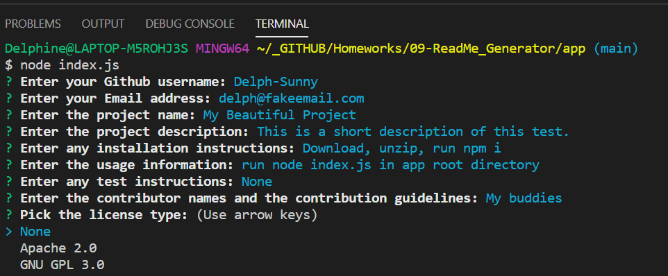

# 09-ReadMe_Generator  


:construction:   IN PROGRESS  :construction:  


---

<a href="https://img.shields.io/badge/javascript-100%25-blue?style=plastic"></a>
 <a href="https://img.shields.io/badge/node-v12.19.0-orange?style=plastic"></a>
 <a href="https://img.shields.io/badge/npm-Inquirer-red?style=plastic"></a>
 <a href="https://img.shields.io/badge/License-MIT-brightgreen?style=plastic"></a>  


## Description
This app will generate a professional README.md file from a user's input using the [Inquirer package](https://www.npmjs.com/package/inquirer).

```
User Story Acceptance Criteria
```
```
GIVEN a command-line application that accepts user input
WHEN I am prompted for information about my application repository
THEN a high-quality, professional README.md is generated with the title of my project and sections entitled Description, Table of Contents, Installation, Usage, License, Contributing, Tests, and Questions
WHEN I enter my project title
THEN this is displayed as the title of the README
WHEN I enter a description, installation instructions, usage information, contribution guidelines, and test instructions
THEN this information is added to the sections of the README entitled Description, Installation, Usage, Contributing, and Tests
WHEN I choose a license for my application from a list of options
THEN a badge for that license is added near the top of the README and a notice is added to the section of the README entitled License that explains which license the application is covered under
WHEN I enter my GitHub username
THEN this is added to the section of the README entitled Questions, with a link to my GitHub profile
WHEN I enter my email address
THEN this is added to the section of the README entitled Questions, with instructions on how to reach me with additional questions
WHEN I click on the links in the Table of Contents
THEN I am taken to the corresponding section of the README
```


## Table of Contents  

* [Installation](#Installation)  
* [Usage](#Usage) 
* [Image of the app](#Image%20of%20the%20app%20:mag:) 
* [License](#License)  
* [Contact](#Contact) 


## Installation  
  
- Open a terminal instance  
- Clone the following [repo](https://github.com/Delph-Sunny/09-ReadMe_Generator)  
- Navigate to the app folder, using `cd app`
- In the working directory, install the Inquirer package with the following code line `npm i`  
- Once the dependencies have been installed, enter `node index.js`  
- Answer to each question following with Enter. A README.md file will be generated once all answers have been provided.  

###### Note: Node.js installation is required before using this app.  

## Image of the app :mag:  




## License  

Copyright (c) 2021 DT.  
This project is [MIT](https://github.com/kefranabg/readme-md-generator/blob/master/LICENSE) licensed.

## Contact  

GitHub: [Delphine](https://github.com/Delph-Sunny)  


---

